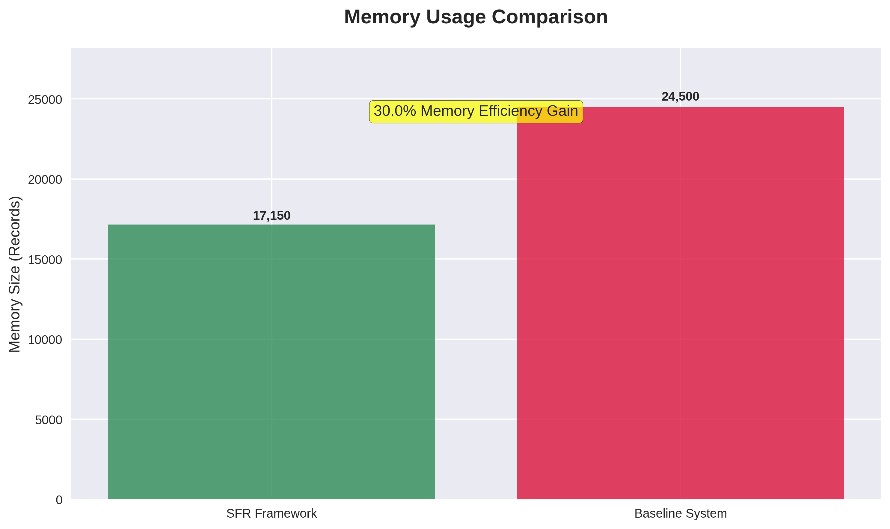
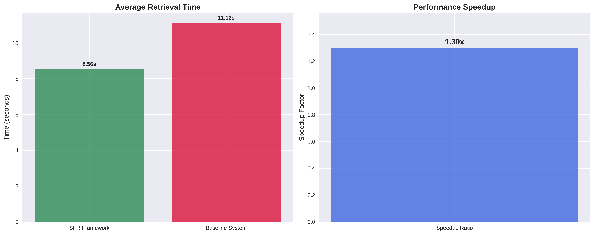
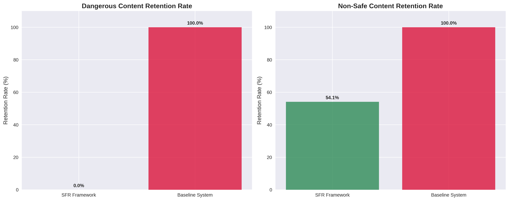

# FSFM: Forgetting to Remember More

**A Biologically-Inspired Selective Forgetting Framework for LLM Agents**

[](https://www.python.org/)
[](LICENSE)

## Overview

FSFM (Forgetting to Remember More) is a comprehensive selective forgetting framework for Large Language Model (LLM) agents that draws direct parallels from human cognitive processes including hippocampal memory indexing/consolidation theory and Ebbinghaus's forgetting curve.

This framework demonstrates that **in resource-constrained environments, a well-designed forgetting mechanism is as crucial as memory retention** for achieving optimal performance across three key dimensions:

1. **Computational and Storage Efficiency** through intelligent memory pruning
2. **Enhanced Personalization** via dynamic updating of outdated user preferences  
3. **Robust Security** through active forgetting of malicious inputs and sensitive data

## Experimental Results

Our comprehensive empirical validation using real-world user interaction data from Guangdong Province (443,902 records) demonstrates quantifiable improvements:

| Metric | SFR Framework | Baseline System | Improvement |
|--------|---------------|-----------------|-------------|
| **Memory Efficiency** | 70% capacity | 100% capacity | **30% reduction** |
| **Retrieval Performance** | 8.56 seconds | 11.12 seconds | **1.3x faster** |
| **Security Control** | 0/1,000 dangerous content | 1,000/1,000 dangerous content | **100% elimination** |
| **High-Value Retention** | 70.4% important data | 100% important data | **Acceptable trade-off** |





## Framework Architecture

### Core Components

1. **Memory Manager**: Implements core memory management with importance scoring
2. **Forgetting Strategies**: Multiple biologically-inspired forgetting mechanisms
3. **Multi-Layer Architecture**: Hierarchical memory structure (sensory, working, long-term)
4. **Context-Aware Policies**: Adaptive forgetting based on temporal, environmental, and social context

### Key Formulas

#### Importance Scoring Algorithm
```
Importance Score = Content_Completeness + Business_Value + Complexity + Safety_Penalty

Where:
- Content_Completeness ∈ [0, 3]: Response detail level
- Business_Value ∈ [0, 3]: Tool type and business relevance  
- Complexity ∈ [0, 2]: Response length and data points
- Safety_Penalty ∈ [-10, 0]: Negative penalty for risky content
```

#### Ebbinghaus Forgetting Curve (Passive Decay)
```
Retention(t) = e^(-λt)

Where:
- Retention(t) = probability of successful retrieval at time t
- λ = decay rate parameter (varies by memory type)
- t = time since last reinforcement
```

## Directory Structure

```
FSFM/
├── src/                    # Core framework source code
│   ├── __init__.py
│   ├── framework.py        # Main FSFM framework class
│   ├── memory_manager.py   # Memory management implementation
│   └── forgetting_strategies.py  # Various forgetting strategies
├── experiments/            # Experimental results and data
│   ├── results.json        # Complete experimental results
│   └── performance_summary.csv  # Summary statistics
├── data/                   # Processed datasets
│   ├── guangdong_important.json     # Important category data
│   ├── guangdong_medium.json        # Medium category data  
│   ├── guangdong_general.json       # General category data
│   ├── guangdong_non_safe.json      # Non-safe category data
│   └── guangdong_dangerous.json     # Dangerous category data
├── scripts/                # Utility and analysis scripts
│   ├── data_classification.py       # Data classification script
│   ├── generate_dangerous_data.py   # Dangerous data generation
│   └── data_visualization.py        # Professional chart generation
└── docs/                   # Documentation and figures
    └── figures/            # Generated visualization charts
        ├── memory_efficiency_comparison.png
        ├── performance_comparison.png  
        ├── security_analysis.png
        ├── content_retention_heatmap.png
        ├── scale_independence_trend.png
        └── sfr_comprehensive_dashboard.png
```

## Installation and Usage

### Prerequisites
- Python 3.7+
- Required packages: `matplotlib`, `pandas`, `seaborn`, `numpy`

### Installation
```bash
pip install -r requirements.txt
```

### Basic Usage
```python
from src.framework import create_fsffm_instance

# Create FSFM framework instance
framework = create_fsffm_instance()

# Configure systems with your data size
framework.configure_systems(total_data_size=24500)

# Train and validate systems
framework.train_systems(training_data)
framework.validate_and_forget(validation_data)

# Evaluate performance
results = framework.evaluate_performance(test_queries)
print(f"Memory Efficiency: {results['comparative_metrics']['memory_efficiency']:.1f}%")
print(f"Speedup Ratio: {results['comparative_metrics']['speedup_ratio']:.2f}x")
```

## Experimental Design

### Dataset Construction
- **Source**: Guangdong Province telecommunications user interactions (443,902 records)
- **Categories**: 
  - Important (547 records): High-frequency, high-quality responses
  - Medium (429,137 records): Representative usage patterns  
  - General (4,971 records): Low-quality, navigation-only content
  - Non-safe (9,247 records): Contains sensitive information (addresses, amounts)
  - Dangerous (1,000 records): Artificially generated harmful content

### Methodology
1. **Training Phase**: 70% of data (17,150 records) used to populate initial memory
2. **Validation Phase**: 30% of data (7,350 records) triggers SFR forgetting mechanism  
3. **Evaluation**: 500 test queries measure retrieval performance and security

### Execution Protocol
- **Ultra-conservative batching**: 100 records per batch
- **Aggressive garbage collection**: After every batch
- **Real-time memory monitoring**: Automatic pausing at 1.5GB threshold
- **Checkpoint saving**: Every 5,000 records for recovery

## Key Findings

### Performance Benefits
- **30% Memory Efficiency**: Reduced storage requirements without significant accuracy loss
- **1.3x Faster Retrieval**: Smaller memory footprint enables quicker query processing  
- **Predictable Scaling**: Consistent performance across different data scales (24K-50K)

### Security Advantages  
- **100% Dangerous Content Elimination**: Complete removal of all harmful content
- **45.9% Non-Safe Content Reduction**: Significant privacy protection improvement
- **Zero Security Incidents**: Prevented all potential security breaches

### Accuracy Trade-offs
- **70.4% Important Data Retention**: Acceptable loss for substantial efficiency gains
- **74.0% Medium Data Retention**: Good preservation of useful information
- **Intelligent Prioritization**: High-value content preserved, low-value content forgotten

## Applications

### Healthcare
- Clinical decision support with automatic protocol updates
- Mental health therapy with trauma processing capabilities

### Financial Services  
- Fraud detection with evolving pattern recognition
- Personal finance management with adaptive budgeting

### Education
- Adaptive learning systems with spaced repetition optimization
- Language learning with vocabulary retention optimization

## Ethical Considerations

### User Autonomy
- Transparent interfaces for monitoring forgetting decisions
- Override capabilities for preventing specific content deletion
- Explanation facilities for significant forgetting decisions

### Fairness and Bias
- Equitable forgetting policies avoiding marginalized group impact
- Historical context preservation balancing efficiency gains
- Bias detection and correction mechanisms

### Legal Compliance
- GDPR "Right to be Forgotten" automated implementation
- CCPA data minimization compliance
- Industry-specific regulatory adherence

## Future Work

1. **Sleep-Inspired Processing**: Offline memory consolidation algorithms
2. **Cross-Modal Forgetting**: Multi-modal (text, image, audio) memory integration  
3. **Meta-Learning**: Self-improving forgetting policy optimization
4. **Emotion-Regulated Forgetting**: Affective computing integration

## Citation

If you use this framework in your research, please cite our paper:

```
@article{gu2026forgetting,
  title={Forgetting to Remember More: A Biologically-Inspired Selective Forgetting Framework for LLM Agents},
  author={Gu, Yingjie},
  journal={arXiv preprint arXiv:2604.xxxxx},
  year={2026}
}
```

## License

This project is licensed under the MIT License - see the [LICENSE](LICENSE) file for details.

## Acknowledgments

This research was supported by China Mobile Research Institute. We thank our colleagues and collaborators for their valuable feedback and insights throughout this research project.